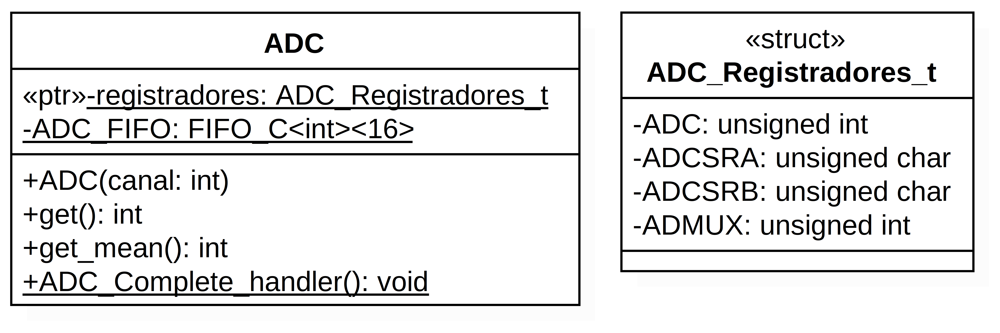
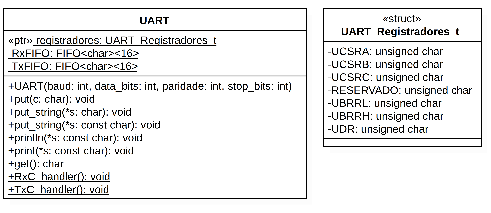
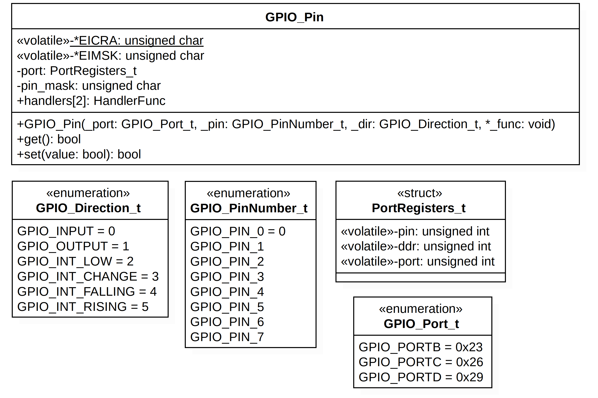
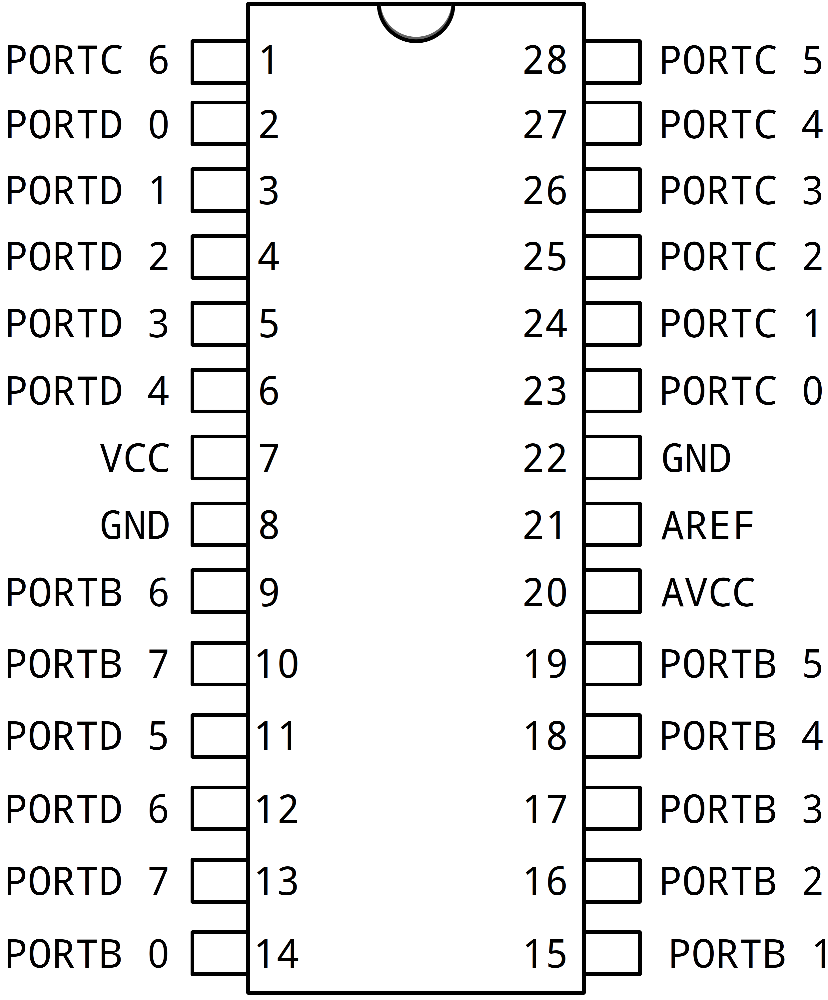

# Atividade 2 - Programação de Sistemas Embarcados

Neste repositório constam as implementações dos módulos USART, ADC e GPIO do microcontrolador ATMega328p utilizando interrupção.

## Compilação e gravação

Para compilar e gravar no microcontrolador ATMega328p, basta utilizado os comandos abaixo:

```C++
make clean ; make
```

O comando ```make clean``` garante que código antigo seja atualizado.


## Projeto

O programa de teste encontra-se no arquivo _projeto.cpp_. A função _main_ está no arquivo _main.cpp_. O motivo da separação é para remeter o próximo possível da forma como é feita a implementação utilizando a IDE do Arduino.

## ADC

O módulo ADC é o conversor de sinal analógico para digital. Através dele, um sinal de tensão é amostrado e convertido em um número inteiro digital.

Abaixo está o diagrama de classes do ADC:



Na implementação do ADC, foi utilizada interrupção para sinalizar uma conversão finalizada. Dessa forma, cada vez que uma interrupção fosse emitida por este componente, o valor resultante da conversão era guardado em uma fila circular.

### Construtor

Um canal é passado como parâmetro e indica em qual pino será obtido o sinal para conversão. Esse canal é ajustado no registrador ADMUX de forma que outros pinos já definidos não sejam sobrescrevidos:

```C++
registradores->ADMUX = (1 << 6) | (canal & 0x0f);
```

Para habilitar a interrução os bits ADATE e ADIE foram definido em 1:

```C++
registradores->ADCSRA |= (1 << 5); // ADATE
registradores->ADCSRA |= (1 << 3); // ADIE
```

O bit ADEN habilita o módulo do conversor em si:

```C++
registradores->ADCSRA |= (1 << 7); // ADEN
```

Os bits ADPS2, ADPS1 e ADPS0 definem o fator de escalonamento que, neste caso, foi ajustado para 128. Para tal, tais bits foram definidos em 1:

```C++
registradores->ADCSRA |= 0b00000111; // ADPS2, ADPS1 e ADPS0
```

Definindo os bits ADTS2, ADTS1 e ADTS0 para 1, habilita-se o modo "free running" do conversor, o que significa que o mesmo ficará operando o tempo todo e gerando uma interrupção quando cada conversão for finalizada.

```C++
registradores->ADCSRB &= 0b11111000;
```

Como garantia, a interrupção global também é habilitada:

```C++
__asm__ ("sei");
```

Por fim, o bit que inica o ciclo de conversões é definido em 1:

```C++
registradores->ADCSRA |= (1 << 6); // ADSC 
```

### Método get

Este método retorna o valor mais recente que foi obtido da conversão.

```C++
return ADC_FIFO.getLast();
```

### Método get_mean

Este método retorna a média dos 16 valores que estão guardados na fila circular. O objetivo é obter um resultado final mais consistente, visto que serão mais amostras a serem realizadas.

```C++
int resultado = 0;
for (int c = 0; c < 16; c++){
    resultado += ADC_FIFO.get(c);
}
return resultado / 16;
```

A cada invocação a fila é percorrida da posição zero a 15 e todos os valores são somados, sendo divididos por 16 ao final.

### Método ADC_Complete_handler

Este método é invocado internamente toda vez em que ocorra uma interrupção gerada pelo módulo ADC.

A cada invocação, o resultado da conversão é enfileirado:

```C++
ADC_FIFO.enqueue(registradores->ADC);
```

### Declarações privadas

Foi declarada uma _struct_ para referenciar os registradores:

```C++
struct ADC_Registradores_t {
    // Mapeia 16 bis para o ADC.
    // int possui 16 bits, enquanto char possui 8 bits
    // int ADC já mapeia os registradores 0x78 (ADCL) e 0x79 (ADCH)
    unsigned int ADC;
    unsigned char ADCSRA;
    unsigned char ADCSRB;
    unsigned char ADMUX;  // Escolhe o pino e outras opções
};
```

Note que para os registradores ADCL e ADCH, como nesta biblioteca o valor do bit ADLAR do registrador ADMUX é definido em 0, foi utilizado o tipo _int_, que possui 16 bits, e engloba ambos registradores.

Foi criado um ponteiro estático do tipo _ADC_Registradores_t_ que será utilizado para acessar cada registrador.

Por fim, foi criado um objeto estático do tipo _FIFO_C_, que é a fila circular que conterá os resultados de cada conversão.

```C++
static FIFO_C<int,16> ADC_FIFO;
```

### Tratador de interrupção

Para aproveitar de algumas facilidades do compilador, foi criado um arquivo do tipo _cpp_ que contém a associação dos vetores de interrução aos seus tratadores. Nesse caso, o mapeamento é feito pelo próprio compilador:

```C++
#include "ADC.h"

ADC::ADC_Registradores_t * ADC::registradores = (ADC_Registradores_t *) 0x78;
FIFO_C<int,16> ADC::ADC_FIFO;

extern "C" {
    void __vector_21() __attribute__ ((signal));
}

void __vector_21(){
    // chamar o tratador da interrupção do ADC
    ADC::ADC_Complete_handler();
}
```

O vetor 22 (para o compilador é o vetor 21 pois a contagem dos vetores começa em 0) é o responsável pela interrupção do ADC, sendo este o "ADC conversion complete".

## UART

O componente da UART serializa os dados para que possam ser capturados externamente por, por exemplo, um terminal serial. Dessa forma, é possível externalizar resultado das operações realizadas, bem como realizar a depuração do programa. 

Este componente também foi implementado utilizando interrupção de forma a deixar o processo mais eficiente e diminuir o consumo de processamento e energia, além de evitar uma espera ocupada por conta do uso de _polling_.

Abaixo, está o diagrama de classe:



### Construtor

No construtor é definido qual será o _baudrate_, os _data bits_, a paridade e os _stop bits_.

```C++
UART(int baud, int data_bits = 8, int paridade = 0, int stop_bits = 1);
```

O único valor que o usuário é obrigado a definir é o _baudrate_, que é a taxa de atualização da porta serial. O valor a ser defino é um inteiro.

Na instanciação da UART, são definidos os bits que configuram a forma como esta irá operar.

A interrupção de recepção é habilitada no registrador UCSRB, onde o bit 7 (RXCIE) é definido em 1:

```C++
registradores->UCSRB = (1 << 7) | (1 << 4) | (1 << 3);
```

A interrupção para a saída de dados via UART é habilitada somente quando o método que insere um dado para saída é chamado. No caso, é o método _put_.

### Método put

Utilizando uma fila, a cada chamada, enfileira o dado que deseja-se ser transmitido pela UART. O dado só será inserido caso a fila não esteja cheia. A fila em questão possui tamanho de 16 caracteres.

Antes de adicionar o caractere na fila, a interrupção global é desativada:

```C++
__asm__ ("cli");
```

Isso faz com que a UART não emita uma interrupção e, consequentemente, chamando o tratador antes que um dado tenha sido adicionado a fila. Após o dado ser adicionado na fila, o bit UDRIE é definido para 1 e a interrupção global é reativada. 

Todo esse processo fica dentro dentro de um laço que valida se é possível enfileirar o caractere passado como parâmetro:

```C++
void put(char c){
    int retorno_fila;
    do {
    __asm__ ("cli"); // Desativa a interupção global
    retorno_fila = TxFIFO.enqueue(c);
    registradores->UCSRB |= (1 << 5);
    __asm__ ("sei"); // Reativa a interrupção global
    } while (retorno_fila == FIFO<char,16>::FIFO_ERROR_FULL);
}
```

### Métodos put_string, println e print

Estes métodos usam o método anterior, basicamente chamando-o várias vezes de acordo com a sequência de caracteres recebida.

No caso do método _println_, foi baseado no método da biblioteca do Arduino e adiciona uma quebra de linha no final da sequência.

### Método get

Objetiva obter um caractere externo através da UART, para que possa ser processado dentro do programa.

Tal caractere é obtido através de uma fila. Essa fila é alimentada pelo método tratador da interrupção do recebimento de dados (RX). A cada chamada deste método, um caractere é desenfileirado e retornado para ser usado dentro da aplicação.

### Método RxC_handler

É o tratador da interrupção de recebimento, habilitada no construtor.

Cada vez que um dado é inserido via UART, uma interrupção é gerada e este método é chamado. Este enfileira o dado na fila destinada a esta finalidade:

```C++
static void RxC_handler(){
    RxFIFO.enqueue(registradores->UDR);

}
```

### Método TxC_handler

Trata as interrupções para a transmissão de dados via UART.

O método desenfileira o dado, enfileirado no método _put_, e atribui ao registrador UDR, o qual envia o mesmo via UART. É nesse momento que o dado pode ser obtido fora do microcontrolador.

Nesse método, sempre que a fila não estiver vazia e novas interrupções ocorrerem, um dado será desenfileirado e atribuído ado registrador UDR.

Caso a fila esteja vazia, o bit ADRIE é defino em zero, desativando a interrupção da UART.

```C++
static void TxC_handler(){
    char dado;
    if (TxFIFO.dequeue(&dado) != FIFO<char,16>::FIFO_ERROR_EMPTY) {
        registradores->UDR = dado;
    } else registradores->UCSRB &= ~(1 << 5);

}
```

### Declarações privadas

Foi criada uma _struct_ com as referências para os registradores:

```C++
struct UART_Registradores_t {
    unsigned char UCSRA;
    unsigned char UCSRB;
    unsigned char UCSRC;
    unsigned char RESERVADO;
    unsigned char UBRRL;
    unsigned char UBRRH;
    unsigned char UDR;
};
```

Foi criado um ponteiro estático do tipo _UART_Registradores_t_:

```C++
static UART_Registradores_t *registradores;
```

Além de duas instâncias de fila, uma para ser usada no método tratador da interrupção de recebimento e outra para ser usada no método tratador da interrupção de envio.

```C++
static FIFO<char,16> RxFIFO;
static FIFO<char,16> TxFIFO;
```

### Tratador de interrupção

Como no caso anterior, para aproveitar de algumas facilidades do compilador, foi criado um arquivo do tipo _cpp_ que contém a associação dos vetores de interrução aos seus tratadores.

O arquivo ficou dessa forma:

```C++
#include "UART.h"
 
UART::UART_Registradores_t *UART::registradores = (UART_Registradores_t*) 0xc0;
FIFO<char,16> UART::RxFIFO;
FIFO<char,16> UART::TxFIFO;

extern "C" {
    void __vector_18() __attribute__ ((signal));
    void __vector_19() __attribute__ ((signal));
}

void __vector_18(){
    // chamar o tratador da interrupção de recebimento
    UART::RxC_handler();
}

void __vector_19(){
    // chamar o tratador da interrupção de envio
    UART::TxC_handler();
}
```
Os vetores 19 e 20 são o "USART Rx complete" e "USART, data register empty", respectivamente.

## GPIO

As portas de entrada/saída de propósito geral (GPIO), permitem receber ou enviar sinais de valor fixo, ou seja, pulsos. Quando uma porta deste componente é definida como entrada, por exemplo, é possível inserir um sinal de tensão de 3,3 volts. Dentro do programa, o valor de 3,3 volts pode ser representado como valor 1 e se a tensão for zero volts, pode ser representado como valor 0. Consequentemente, é possível ter um botão que realiza uma ação no programa.

Da mesma forma, quando uma porta desse componente é definida como saída, a mesma pode ser utilizada para acender um LED, já que, quando a mesma está definida como saída, seus valores de tensão possíveis são 3,3 volts e zero volts.

Na implementação do GPIO nesta biblioteca, foi utilizado interrupção para detectar a entrada de sinal. Dessa forma, cada vez que um sinal de 3,3 volts é inserido em uma porta GPIO de entrada, uma interrupção é gerada e um tratador é chamado. Isso permite, por exemplo, acionar um botão a qualquer momento no programa sem a necessidade de que outra rotina já em execução precise ser finalizada. Para tal, a biblioteca foi implementada de forma que a função tratadora seja escolhida pelo usuário.

O dia grama de classes do componente do GPIO ficou dessa forma:



O GPIO possui três registradores chamados PORTB, PORTC e PORTD. Cada um deles é responsável por um grupo de pinos físicos do microcontrolador.



### Funções tratadoras de interrupção

Publicamente, foi definido o tipo _HandlerFunc_ para receber as funções que tratarão as interrupções _INT0_ ou _INT1_:

```C++
typedef void (*HandlerFunc)(void);
static HandlerFunc handlers[2];
```

### Construtor

No construtor da classe GPIO_Pin, o usuário é obrigado a definir a porta do pino físico que será utilizado, o número do pino em si, e a direção se é entrada ou saída. Caso seja entrada e uma função tratadora for definida, o uso de interrupção será habilitado.

Inicialmente, define-se qual será o endereço do grupo de portas que será utilizado:

```C++
port = (PortRegisters_t *) _port;
```

Dessa forma, é escolhido entre PORTB, PORTC ou PORTD. Em seguida, é definido o bit do pino que será utilizado. Para fins de praticidade, criou-se um máscara que será utilizada futuramente. Como os registradores são compartilhados, ao se mexer em um pino, é preciso tomar cuidado para interferir em outro.

```C++
pin_mask = 1 << _pin;
```

Caso o pino tenha direção de entrada, o bit do mesmo é definido em 0. Caso seja definido para saída, é defido em 1. O registrador ajustado é o DDR.

Caso queira-se utiliza interrupção, o registrador EICRA (External Interrupt Control Register A) também será ajustado. Nesse registrador, há duas interrupções que podem ser utilizadas:

- Interrupt 1 Sense Control: bits ISC11 e ISC10
- Interrupt 0 Sense Control: bits ISC01 e ISC00

Cada dupla de bits de cada controle de interrupção controla o tipo de situação a qual será gerada a interrupção. os modos podem ser:

| ISC11/ISC10 | ISC10/ISC00 | Descrição
|:-----------:|:-----------:|-----------
| 0           | 0           | Gera interrupção quando em nível baixo
| 0           | 1           | Gera interrupção quando há mudança lógica
| 1           | 0           | Gera interrupção na borda de descida do sinal de entrada
| 1           | 1           | Gera interrupção na borda de subida do sinal de entrada

O registrador EIMSK também precisa ser ajustado. Nele, os dois bits menos significativos ativam ou desativam cada uma das interrupções (INT0 e INT1).

O código do construtor que faz essas definições ficou dessa forma:

```C++
GPIO_Pin(GPIO_Port_t _port, GPIO_PinNumber_t _pin, GPIO_Direction_t _dir, void (*_func)(void) = 0){
    port = (PortRegisters_t *) _port;
    pin_mask = 1 << _pin;

    if (_dir == GPIO_INPUT){
        port->ddr &= ~pin_mask;
    } else if (_dir == GPIO_OUTPUT){
        port->ddr |= pin_mask;

    } else { // Interrupção - INT0 e INT1
        int interrupt = _pin - 2;
        int edge = _dir - 2;
        unsigned char mask = (3 << interrupt * 2);

        *EICRA = (*EICRA & ~mask | (edge << interrupt * 2));

        *EIMSK |= (1 << interrupt);
        handlers[interrupt] = _func;
    }
}
```

### Método get

Retorna verdadeiro caso o pino esteja recebendo ou saindo sinal de 3,3 volts.

```C++
bool get() {
    return ((port->pin & pin_mask) > 0);
}
```

Na operação lógica, é verificado se o bit correspondente ao pino contém o valor 1. Caso seja 1, o retorno é verdadeiro, caso contrário, o retorno é falso.

### Método set

Define o valor do pino de saída. Caso seja definido como verdadeiro, o pino de saída assume valor alto. Caso contrário, valor zero.

```C++
void set(bool value){
    if (value == 0) port->port &= ~pin_mask;
    else if (value > 0) port->port |= pin_mask;
}
```

### Declarações privadas

Foi criada uma _struct_ para mapear os registradores utilizados. Como os endereços dos mesmo são sequenciais, bastando definir o valor do primeiro endereço, o compilador mapeia o restante sequencialmente. Para que isso funcione como desejado, as variáveis são declaradas na ordem correta.

```C++
struct PortRegisters_t {
    volatile unsigned char pin;
    volatile unsigned char ddr;
    volatile unsigned char port;
};
```

Foram criados ponteiros estáticos e voláteis para os registradores EICRA e EIMSK:

```C++
static volatile unsigned char * EICRA;
static volatile unsigned char * EIMSK;
```

Foi criado um ponteiro para o mapeamento da _struct_:

```C++
PortRegisters_t *port;
```

Por fim, foi criado uma variável do tipo ```char``` para ser utilizada como máscara do pino que será utilizado.

```C++
unsigned char pin_mask;
```

### Enumerações

Para facilitar o uso dos pinos pelo usuário, foram criadas enumerações que auxiliam a definir a funcionalidade desejada:

```C++
enum GPIO_Port_t {
    GPIO_PORTB = 0x23,
    GPIO_PORTC = 0x26,
    GPIO_PORTD = 0x29
};

enum GPIO_Direction_t {
    GPIO_INPUT = 0,
    GPIO_OUTPUT = 1,
    GPIO_INT_LOW = 2,
    GPIO_INT_CHANGE = 3,
    GPIO_INT_FALLING = 4,
    GPIO_INT_RISING = 5
};

enum GPIO_PinNumber_t {
    GPIO_PIN_0 = 0,
    GPIO_PIN_1,
    GPIO_PIN_2,
    GPIO_PIN_3,
    GPIO_PIN_4,
    GPIO_PIN_5,
    GPIO_PIN_6,
    GPIO_PIN_7
};
```

### Tratador de interrupção

Como no caso anterior, para aproveitar de algumas facilidades do compilador, foi criado um arquivo do tipo _cpp_ que contém a associação dos vetores de interrução aos seus tratadores.

O arquivo ficou dessa forma:

```C++
#include "GPIO_Pin.h"

GPIO_Pin::HandlerFunc GPIO_Pin::handlers[2];
volatile unsigned char * GPIO_Pin::EICRA = (volatile unsigned char *) 0x69;
volatile unsigned char * GPIO_Pin::EIMSK = (volatile unsigned char *) 0x3d;

extern "C" {
    void __vector_1() __attribute__ ((signal));
    void __vector_2() __attribute__ ((signal));
}

void __vector_1(){
    // chamar o tratador do INT0
    GPIO_Pin::handlers[0]();
}

void __vector_2(){
    // chamar o tratador do INT1
    GPIO_Pin::handlers[1]();
}
```
Os vetores 2 e 3 cuidam das interrupções _INT0_ e _INT1_, respectivamente. Nesse caso, os tratadores são definidos pelo usuário.