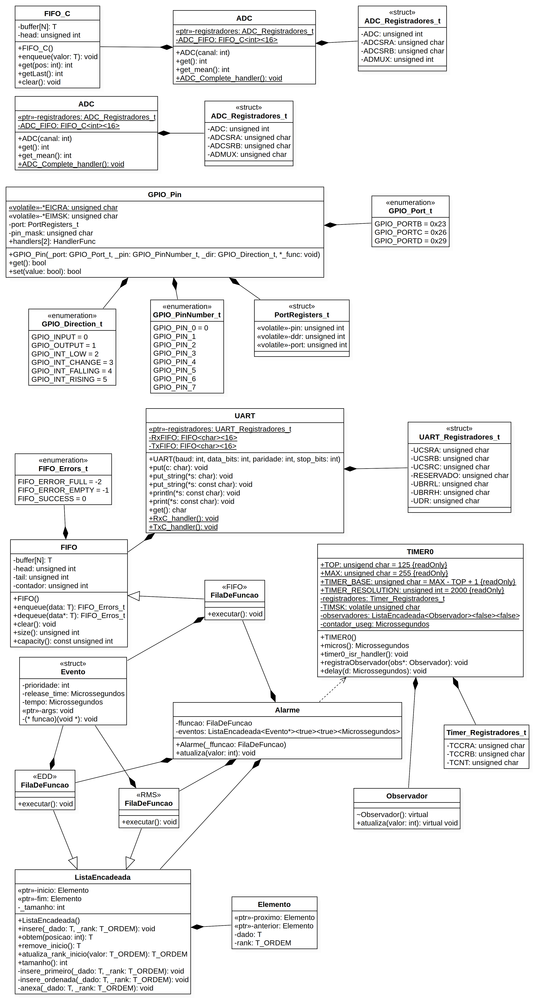

# Atividade 3 - Fila de funções e escalonamento

Neste repositório constam as implementações da fila de função, alarme, temporizador (*Timer*).

### Sumário

- [Requisitos](#requisitos)
- [Compilação e gravação](#compilação-e-gravação)
- [Projeto](#projeto)
  - [Lista Encadeada](#lista-encadeada)
  - [Alarme](#alarme)
  - [Temporizador](#temporizador)
  - [FIFO Circular](#fifo-circular)
  - [Fila de função](#fila-de-função)
  - [Programas de teste](#programas-de-teste)
  - [Resultados](#resultados)
- [Diagrama de classes da biblioteca inteira](#diagrama-de-classes-da-biblioteca-inteira)

## Requisitos

Para compilar e gravar o código no microcontrolador, é necessário ter instalado o compilador AVR-GCC e o gravador AVRDUDE. Para instalar, basta executar o comando abaixo:

```
sudo zypper install cross-avr-gcc14 avr-libc cross-avr-binutils avrdude
```

## Compilação e gravação

Para compilar e gravar no microcontrolador ATMega328p, basta utilizar os comandos abaixo:

```C++
make clean all
```

O comando ```make clean``` garante que código antigo seja atualizado.


## Projeto

O projeto consistiu em aplicações que demonstram o funcionamento de dois escalonadores de funções: RMS (Rate Monotonic Scheduling) e EDD (Earliest Due Date).

## Lista Encadeada

A lista encadeada facilita bastante a implementação de outras funcionalidades na biblioteca como um todo. Ela é declarada da seguinte forma

```C++
ListaEncadeada<T tipo, bool ORDENADA, bool RELATIVA, T_ORDEM ordem>;
```

Dessa forma, ela é capaz de guardar dados de forma a mantê-los sempre ordenados de acordo um _rank_ especificado no tipo de dados _T_ORDEM_. Isso permite definir logo de início quem poderá ter uma posição mais facilitada de acesso.

### Método "insere"

Declarado da seguinte forma:

```C++
void insere(T _dado, T_ORDEM _rank = 0);
```

Quando um dado é inserido na lista, caso o parâmetro "ORDENADA" seja definido como "true", o dado é inserido na lista de acordo com o seu "_rank". Caso "ORDENADA" seja "false", o dado é anexado ao final da lista. Se "_rank" não for especificado, é assumido o valor padrão 0.

### Método "obtem"

Declarado da seguinte forma:

```C++
T obtem(int posicao);
```

Permite acessar um dado em uma posição específica da lista.

### Método "remove_inicio"

Declarado da seguinte forma:

```C++
T remove_inicio();
```

Remove o primeiro ítem da lista e retorna o mesmo. Com isso, o segundo elemento da lista, passa a ser o primeiro.

### Método "atualiza_rank_inicio"

Declarado da seguinte forma:

```C++
T_ORDEM atualiza_rank_inicio(T_ORDEM valor)
```

Ajusta o atributo _rank_ do primeiro elemento da lista, retorando o novo rank.

### Método "tamanho"

Retorna o tamanho atual da lista.

### Método "insere_primeiro"

É privado e declarado da seguinte forma:

```C++
void insere_primeiro(T _dado, T_ORDEM _rank);
```

É utilizado quando a lista está vazia e o primeiro elemento será inserido.

### Método "insere_ordenada"

É privado e declarado da seguinte forma:

```C++
void insere_ordenada(T _dado, T_ORDEM _rank);
```

É utilizado quando deseja-se manter a lista ordenada ao mesmo tempo que novos dados são inseridos. A ordem do dado repeita o valor definido em "_rank".

### Método "anexa"

É privado e declarado da seguinte forma:

```C++
void anexa(T _dado, T_ORDEM _rank);
```

Utilizado quando o dado a ser inserido ocupa a última posição, ou seja, é anexado ao final da lista.

## Alarme

Utilizado para agendar tarefas que devam ser executadas em um dado prazo. Muito útil para o escalonamento de eventos.

Faz o uso de uma lista encadeada para armazenar os eventos e de uma fila de função para armazenar os eventos que serão executados. A fila de função pode ser tanto uma fila padrão, quanto uma lista encadeada. Isso é definido no arquivo "definicoes.h", ajustando o método de escalonamento.

### Método "agenda"

Declarado da seguinte forma:

```C++
void agenda(Evento * evento);
```

Agenda o evento, colocando-o em uma lista encadeada, respeitando seu prazo de execução. O prazo é utilizado como _rank_ da lista e o evento é posicionado de acordo com o mesmo, garantindo que a ordem de execução seja respeitada.

### Método "atualiza"

Declarado da seguinte forma:

```C++
void atualiza(int valor);
```

Atualiza o valor do _rank_ do primeiro elemento da lista. Esse método é chamado no método tratador de interrupção do temporizador (TIMER0). O comportamento desse método varia de acordo com o tipo de escalonamento de tarefas utilizado. 
- Caso o método de escalonamento seja FIFO, apenas enfileira o evento na fila de função. 
- Caso o método de escalonamento seja RMS, insere o evento na fila de função, que é uma lista encadeada. Nesse caso, o valor da prioridade do evento é considerado.
- Caso o método de escalonamento seja EDD, insere o evento na fila de função, que também é uma lista encadeada. Nesse caso, o valor do tempo é considerado. 

## Temporizador

O temporizador é um recurso disponível no _hardware_ do ATMega328p, que permite trabalhar com implementações que envolvam tempo.

Na implementação para esta biblioteca, foi utilizado interrupção para sinalizar quando um ciclo de contagem estiver completo. Dessa forma, cada vez que uma interrupção ocorre, o vetor 16 é chamado e este, por sua vez, chama a função que tratará a interrupção. 
O registrador TCNT armazena o tempo de contagem, que varia de 0 a 255. Nessa biblioteca, essa contagem é forçada da segunite forma

```C++
static const unsigned char TOP = 125;
static const unsigned char MAX = 255;
static const unsigned char TIMER_BASE = MAX - TOP + 1;
TCNT = TIMER_BASE;
```

Dessa forma, a cada interrupção, o registrador é definido para 131, e conta progressivamente até 255, quando ocorre a nova interrupção. Isso gera a precisão desejada.

No temporizador, a contagem de microssegundos é incrementada com uma resolução de 2000 microssegundos.

O tratador de interrupção do temporizador, integra-se com um observador, cujo papel é monitorar o tempo dos eventos do alarme e atualizá-los para que o prazo seja respeitado.

### Método "micros¨

Declarado da seguinte forma:

```C++
static Microssegundos micros();
```

Retorna o tempo, em microssegundos, que já passou desde que o ATMega328p foi ligado.

### Método "timer0_isr_handler"

Declarado da seguinte forma:

```C++
static void timer0_isr_handler();
```

É a função tratadora das interrupções do temporizador.

### Método "registraObservador"

Declarado da seguinte forma:

```C++
void registraObservador(Observador* obs);
```

Armazena os alarmes que serão monitorados para atualizar o _rank_ de seus eventos.

### Método "delay"

Declarado da seguinte forma:

```C++
void delay(Microssegundos d);
```

Põe o sistema em espera pelo tempo em que for definido no parâmetro "d". Esse tempo é em microssegundos.

## FIFO Circular

É uma fila de tamanho "N", definido quando for instanciada. Na fila circular, o elementos pode ser adicionados indefinidamente. Quando a fila atingir o tamanho "N", ou seja, quando todas as posições estiverem ocupadas, o elemento mais antigo é sobrescrevido pelo novo elemento adicionado.

## Fila de função

Nessa biblioteca, dependendo do tipo de escalonamento definido no arquivo "definicoes.h", essa fila pode herdar da FIFO ou da ListaEncadeada. Caso o modo de escalonamento seja "SCHED_FIFO", a fila de função herdará da FIFO. Caso o modo de escalonamento seja "SCHED_RMS" ou "SCHED_EDD", a fila de função herda da ListaEncadeada.

## Programas de teste

Para demonstrar o funcionamento dos escalonadores RMS (Rate Monotonic Scheduler) e EDD (Earliest Due Date), foram criados quatros programas que exemplificam quando há o funcionamento correto e quando o prazo é perdido.

### RMS funcional

Nesse programa, o tempo de funcionamento necessário para "t0" consegue ficar dentro do prazo máximo de "t1". Sendo e0 = 2 e e1 = 2, T0 = 4 e T1 = 6, "t0" tem a prioridade.

Resultado parcial da execução do programa:

```
0 RMS - Funcionando de acordo (exemplo 1)
0 RMS: T0 - inicio
2020 RMS: T0 - fim
2020 RMS: T1 - inicio
4044 RMS: T1 - fim
4044 RMS: T0 - inicio
6068 RMS: T0 - fim
6068 RMS: T1 - inicio
8092 RMS: T1 - fim
8092 RMS: T0 - inicio
10116 RMS: T0 - fim
12000 RMS: T0 - inicio
14004 RMS: T0 - fim
14006 RMS: T1 - inicio
16030 RMS: T1 - fim
```

### RMS cujo T1 perde seu prazo

Nesse programa, o tempo de funcionamento necessário para "t0" consegue ficar dentro do prazo máximo de "t1". Sendo e0 = 2+i e e1 = 2, T0 = 4 e T1 = 6, "t0" tem a prioridade.

Por "t0" ter uma duração de execução, cuja sequência não cabe dentro do prazo de "t1", esta acaba iniciando tadiamente.

Resultado parcial da execução do programa:

```
0 RMS - t1 perdeu seu prazo (exemplo 2)
0 RMS: T0 - inicio
2022 RMS: T0 - fim
2022 RMS: T1 - inicio
4046 RMS: T1 - fim
4046 RMS: T0 - inicio
6072 RMS: T0 - fim
6072 RMS: T1 - inicio
8096 RMS: T1 - fim
8096 RMS: T0 - inicio
10122 RMS: T0 - fim
12000 RMS: T0 - inicio
14006 RMS: T0 - fim
14008 RMS: T1 - inicio
16032 RMS: T1 - fim
16034 RMS: T0 - inicio
18060 RMS: T0 - fim
```

### EDD funcional

Nesse programa, a prioridade é para quem tem o menos prazo para finalizar. Nesse caso, os prazos das tarefas estão dispostas de forma coesa e todo mundo termina no prazo certo.

|    | ek | dk |
|----|:--:|:--:|
| t0 | 1  | 3  |
| t1 | 1  | 10 |
| t2 | 1  | 7  |
| t3 | 3  | 8  |
| t4 | 2  | 5  |

As tarefas são executadas na seguinte ordem: t0, t4, t2, t3, t1.

Resultado da execução do programa:

```
0 EDD - Funcionando de acordo (exemplo 1)
0 EDD: T0 - inicio
1 EDD: T0 - fim
1 EDD: T4 - inicio
3 EDD: T4 - fim
3 EDD: T2 - inicio
4 EDD: T2 - fim
4 EDD: T3 - inicio
7 EDD: T3 - fim
7 EDD: T1 - inicio
8 EDD: T1 - fim
```

### EDD cujo T3 perde seu prazo

Nesse programa, a prioridade é para quem tem o menos prazo para finalizar. Nesse caso, os prazos das tarefas não estão dispostas de forma coesa e todo mundo termina no prazo certo.

|    | ek | dk |
|----|:--:|:--:|
| t0 | 1  | 2  |
| t1 | 2  | 5  |
| t2 | 1  | 4  |
| t3 | 4  | 8  |
| t4 | 2  | 6  |

As tarefas são executadas na seguinte ordem: t0, t2, t1, t4, t3. 

"t3" ficou por último, iniciando no tempo 6. Seu prazo é no tempo 8 e como demora 4 tempos para ser executa, passa 2 tempos do prazo.

Resultado da execução do programa:

```
0 EDD - T3 perdeu seu prazo (exemplo 2)
0 EDD: T0 - inicio
1 EDD: T0 - fim
1 EDD: T2 - inicio
2 EDD: T2 - fim
2 EDD: T1 - inicio
4 EDD: T1 - fim
4 EDD: T4 - inicio
6 EDD: T4 - fim
6 EDD: T3 - inicio
10 EDD: T3 - fim
```

### Resultados

Os resultados dos programas de testes podem ser conferidos no diretório "resultados". Os arquivos de texto tem o seguinte formato:

- EDD: %tempo_em_segundos %texto
- RMS: %tempo_em_milissegundos %texto

## Diagrama de classes da biblioteca inteira

